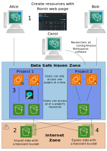

# Data Safe Haven (DSH) {#dsh-home}

This section of the documentation contains information about the
differences between the DSH and RCC platform. As the DSH is a more
controlled environment certain aspects of the system are different to
the RCC platform.

The diagram below shows the structure of the DSH from a users' perspective, together with a workflow through it. 

{ align=left }

After obtaining a login, the user first installs Amazon Workspaces onto their work machine (either Windows or Mac). This allows you to log into the Amazon Workspaces windows machine, and from here, create resources for their project using the Ronin web page.(1).

Using the Ingress tool on the desktop of the user's Amazon Workspaces machine, a user can import data and the software the user needs into the project by uploading to a transient internet-accessible bucket(2).

By using Ronin Link on the user's Amazon Workspaces machine, a user can connect to the machines created earlier to perform their research (3).

Finally, using the egress application in the Amazon Workspaces machine, data can be exported to an egress bucket for checking (4). 
